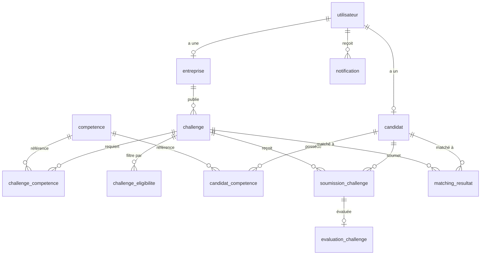

# Talynx Backend — Synthèse Complète

## Vue d'ensemble

**Talynx** est une API REST construite avec **Express.js 5** et **MySQL** qui met en relation des **candidats** avec des **entreprises** à travers un système de **challenges techniques**. L'entreprise publie des défis, un algorithme de matching évalue la compatibilité des candidats, et les candidats soumettent leurs réponses pour être évalués.

## Stack technique

| Composant | Technologie |
|-----------|-------------|
| Framework | Express.js 5 |
| Base de données | MySQL (via mysql2/promise, pool de connexions) |
| Authentification | JWT (jsonwebtoken) + bcrypt |
| Upload de fichiers | Multer (PDF, ZIP, DOCX, images, max 10 Mo) |
| Validation | validator.js |
| Logging | Winston (fichiers + console) |
| Sécurité | express-rate-limit, CORS restreint |

---

## Modules fonctionnels

### 1. 🔐 Authentification (`/api/auth`)
- **Inscription** — crée un utilisateur (`candidat` ou `entreprise`) avec transaction DB, hash bcrypt, validation email, mot de passe min 8 caractères
- **Connexion** — vérifie les identifiants, retourne un token JWT valable 7 jours + le profil associé
- Login rate-limité : 5 tentatives / 15 min par IP

### 2. 👤 Candidats (`/api/candidate`)
- **Profil** — consulter et modifier (nom, prénom, ville, école, diplôme, spécialité, niveau d'étude, bio)
- **Compétences** — ajouter/modifier (avec niveau 1–5), lister, supprimer des compétences liées à un référentiel

### 3. 🏢 Entreprises (`/api/company`)
- **Profil** — consulter et modifier (nom, secteur, description, ville, téléphone, site web)
- **Challenges** — CRUD complet (titre, description, niveau, dates début/fin)
- **Compétences du challenge** — associer des compétences requises avec un poids (importance)
- **Critères d'éligibilité** — définir des filtres (niveau d'étude, spécialité, ville, école)

### 4. 🎯 Matching (`/api`)

C'est le **cœur de l'application**. L'algorithme fonctionne ainsi :

```
Score = (Σ niveau_candidat × poids_compétence) / (Σ 5 × poids_compétence) × 100
+ bonus (10 pts si ≥2 compétences matchées, 15 pts si ≥3)
```

- **Éligibilité** = au moins 1 compétence commune ET tous les critères d'éligibilité satisfaits
- **Côté candidat** — voir les challenges matchés (score ≥ 30, éligibles uniquement)
- **Côté entreprise** — voir les candidats matchés pour un challenge donné
- **Résultats sauvegardés** en DB (`matching_resultat`) pour consultation ultérieure
- **Run matching** — recalculer manuellement (déclenche des notifications)

### 5. 📝 Soumissions (`/api`)
- **Candidat soumet** un challenge (texte + fichier + lien GitHub)
  - Vérification : éligibilité, dates ouvertes, pas de doublon
  - Notification envoyée à l'entreprise
- **Candidat consulte** ses soumissions (avec évaluation si disponible)
- **Entreprise consulte** les soumissions reçues pour un challenge
- **Entreprise évalue** une soumission (note 0–100, commentaire, qualifié oui/non)
  - Notification envoyée au candidat

### 6. 🔔 Notifications (`/api`)
- Lister ses notifications
- Marquer comme lue (une ou toutes)
- Compter les non-lues
- Supprimer une notification

### 7. 📊 Statistiques (`/api/stats`)
- **Candidat** — total soumissions, évaluées, score moyen, qualifications
- **Entreprise** — total challenges, soumissions reçues, évaluations, qualifiés

### 8. 📚 Compétences (`/api/competences`)
- Lister le référentiel de compétences (table partagée)

---

## Schéma de la base de données (déduit du code)



## Architecture des fichiers

```
backend/
├── config/db.js              ← Pool MySQL
├── controllers/              ← Logique métier (8 fichiers)
├── middlewares/
│   ├── authMiddleware.js     ← Vérifie le JWT
│   ├── roleMiddleware.js     ← Vérifie le type (candidat/entreprise)
│   └── uploadSubmission...   ← Config Multer
├── routes/                   ← Définition des endpoints (8 fichiers)
├── services/                 ← Placeholder pour refactoring futur
├── utils/
│   ├── helpers.js            ← Fonctions partagées (DB + éligibilité)
│   ├── logger.js             ← Winston centralisé
│   └── createNotification.js ← Créer une notification en DB
├── tests/                    ← Tests Jest + Supertest
├── uploads/submissions/      ← Fichiers uploadés
├── server.js                 ← Point d'entrée
└── .env                      ← Configuration
```
